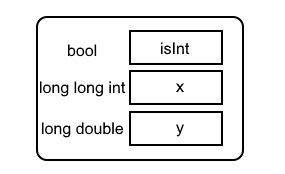

# 简要说明

## 栈的实现

应用模板技术，在MyStack.h内实现了栈的基本功能

## 类成员(calcu.h)

- raw_expression 用于存储用户键入的数学表达式
- 一些标志位，用于表述表达式的基本属性
- 一个用于存储运算结果的自定义类
- 相关成员函数

## 数据存储方式

放弃了直接使用double类型的简便方案，采用了空间代价更大的自定义（**BaseUnit.h**）。计算过程中优先考虑整数运算，条件不允许时（溢出或结果无法用整数表示）才进行浮点运算。相关运算符已重载，可将该自定义类作为操作数参与运算。

## 主函数（calculator.cpp）

得益于类的封装，对于主函数而言，数据的处理细节是个黑盒。主函数基本只负责用户交互逻辑。

## 关于异常捕获机制

由于在运算符重载时对异常进行了相应的过滤，此程序仅处理以下3类异常：

- 零除
- 除零除外的未定义行为
- 无法忽略的精度丢失

>注意：无法忽略的精度丢失并不会被视为致命错误。此版本由vs2017构建，设计时未考虑平台移植性。